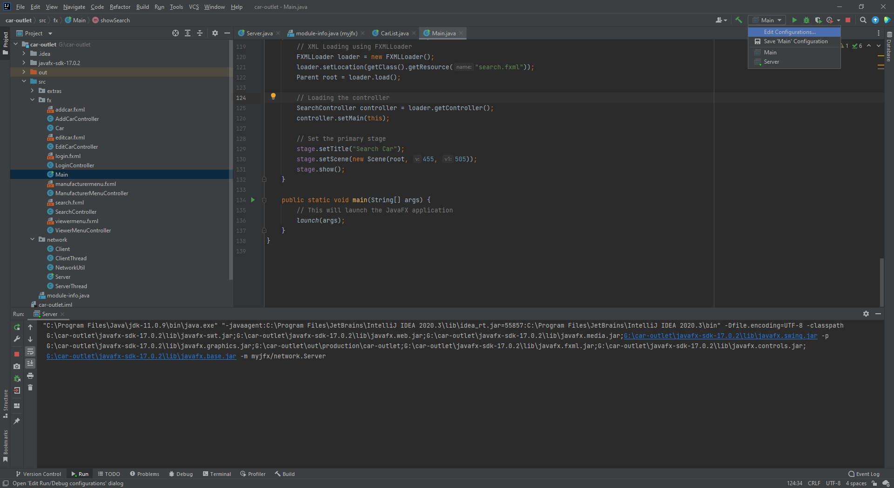
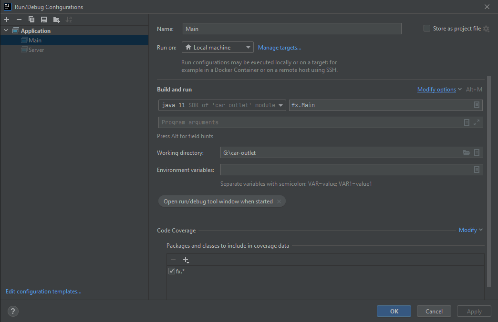
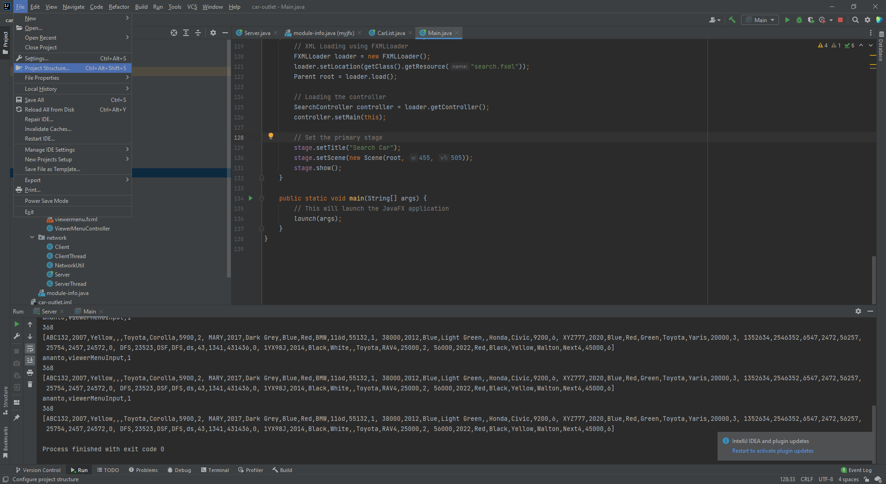
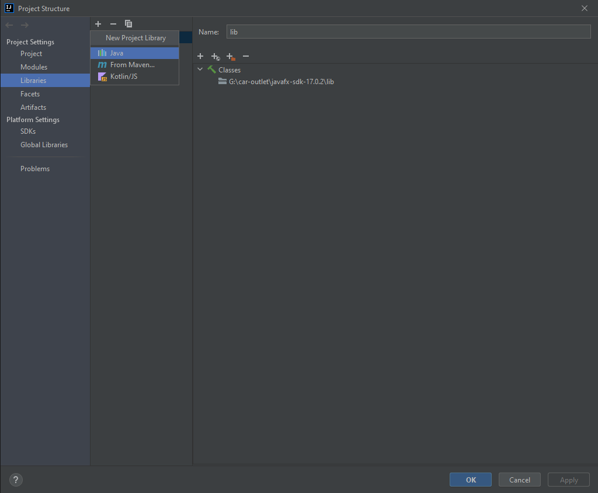
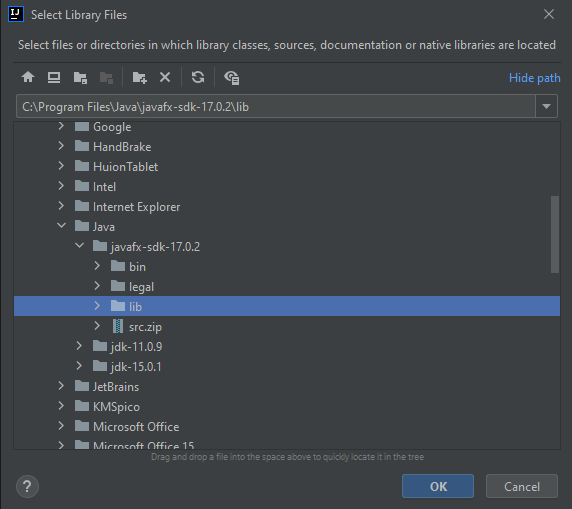

# Car Outlet

This project was made with Java and JavaFX. The idea is to have multiple car sellers and buyers in a marketplace where everyone can login independently and access the common marketplace simultaneously over a network. Yes you guessed it right, the main goal of this project was to implement a network system with a common server and multiple client while also learning some basic designs in JavaFX. It was Level 2 Term 2 in Buet and the course was 'CSE 108 : Object Oriented Programming Language Sessional'

## Setup Locally

First of all, do a `git clone` or download the zip.  

Now if you don't have IntelliJ IDEA installed in your computer, do as I tell you.

INSTALL IT.

Create a  new project at your favorable directory. Copy this repo's `src` and `cars.txt` there. Then it's pretty much all about some clicks here and there. Build the project. Run `/network/Server.java` first and then you can run multiple instances of `/fx/Main.java` to login as Manufacturer (seller) or Viewer (buyer).

Accepted usernames and passwords for login as a manufacturer -
```
admin - 1234
ananto - pass
boss - done
biplob - biplob
```

Accepted usernames and passwords for login as a viewer -
```
viewer - '' (null string, just hit enter)
```

You can hardcode more passwords for manufacturers in the `/network/ServerThread.java`.  
A list of car is maintained by a simple file `cars.txt`. You can simply hardcode more cars by changing this file. In a real life scenario, this can be done by the means of a database.

You need to `Allow multiple instances` in the configuration settings in IntelliJ. To do this, open `/fx/Main.java` and click on `Edit Configurations...` on the top-right. Click `Modify options` and then check the option saying `Allow multiple instances` if unchecked. Not doing this will keep you from creating multiple window of the application at the same time. Remember to do this for `/fx/Main.java` as you want multiple instances of that only.




Now time to setup JavaFX.

## JavaFX

`openjfx-17.0.2_windows_x64_bin-sdk` is already included in the repo. Yet you can get other versions java fx from [gluon](https://gluonhq.com/products/javafx/). Download the zip and unzip it at your preferable folder. You need to add this as an external library in your IDE.





Now click on `Project Structure...` form File Menu on top. Then hit `Lbraries` from the side menu, click the little PLUS button, add the lib folder path og JavaFX as shown in the screenshots and you are good to go.